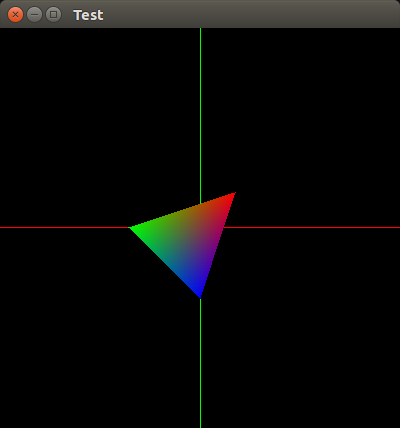

# SoftRenderer

A real-time software rendering pipeline writen by Python.

## Screenshots

## Requirements
- PyOpenGL==3.1.0
- PyOpenGL-accelerate==3.1.0
- numpy==1.15.3
- Cython==0.29
- joblib==0.12.5
